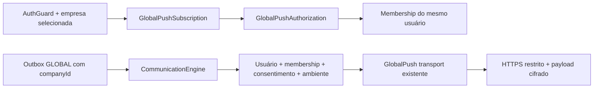

# Fase 4.1-A — Backend Push

Entrega local na branch `develop`, base `15f2177`, em 30/09/2026. Sem commit, push, deploy, frontend, PWA, implementação nativa ou alteração de produção. As alterações locais de diagnóstico PagBank presentes antes desta etapa foram preservadas e não pertencem a esta entrega.

## Auditoria da Fase 3

Foram revisados push.ts/push.spec.ts, módulo/controllers, configuration.ts, transports.ts, engine.ts, worker/scheduler, AuthGuard/AdminGuard/TenantGuard/AuthService, SecretVault, schema, ambas as migrations de comunicação GLOBAL e documentação de arquitetura/segurança/operação da Fase 3.

Já existiam:

- `GlobalPush` como transport real de `PUSH_PENDING` (identificador legado preservado).
- VAPID public/subject em configuração GLOBAL; private key cifrada, write-only e separada por ambiente.
- Registro autenticado/idempotente de endpoint, chaves cifradas por UUID, ownership por usuário e vários dispositivos.
- GET de configuração pública/listagem e DELETE de revogação, proteção Origin e quotas.
- AES128GCM/RFC8291 com web-push; rede HTTPS restrita por allowlist, DNS público fixado, sem redirects e timeout.
- Fanout por dispositivo na mesma outbox, unique por evento/usuário/canal/targetKey, retry limitado e quarentena de envios incertos.
- Revogação 404/410 condicionada ao snapshot, limpeza de expiradas pelo scheduler e bloqueio de VAPID antigo.

Lacunas encontradas: subscription não vinculada ao consentimento por empresa; transport recebia somente o ID do dispositivo; ausência de ambiente no dispositivo e de última aceitação; inexistência de pausa/retomada por empresa e de resultado agregado seguro para envio interno. Não foi criada uma segunda fila/configuração/transporte.

## Arquitetura e modelo

O dispositivo pertence ao usuário e à infraestrutura GLOBAL. `GlobalPushAuthorization` registra consentimento para uma empresa, associado à membership desse mesmo usuário. Isso permite reutilizar um dispositivo entre empresas sem conceder acesso automaticamente a todas elas.



`GlobalPushSubscription`: UUID, scope GLOBAL, userId/FK, provider WEB_PUSH, platform WEB/ANDROID/IOS, environment SANDBOX/PRODUCTION, endpointHash único, credentialsEncrypted (endpoint/p256dh/auth), vapidPublicKey, label opcional, active, expiresAt, revokedAt, lastSeenAt, lastUsedAt, createdAt e updatedAt.

`GlobalPushAuthorization`: subscriptionId, userId, companyId, active, revokedAt, createdAt e updatedAt. PK `(subscriptionId, companyId)` torna o consentimento idempotente. FKs compostas `(subscriptionId,userId)` e `(userId,companyId)` exigem o mesmo proprietário e membership existente. Remover membership remove seus consentimentos; desativá-la impede o envio. O consentimento não configura provider/chaves/templates tenant.

Plataforma ANDROID/IOS significa metadado do navegador Web Push nessa plataforma; não habilita token Expo/FCM/APNs. `NATIVE_PUSH` é um identificador conceitual reservado, rejeitado pela API/transporte atuais.

## Endpoints finais

Todos os endpoints de dispositivos usam AuthGuard real, sessão ativa, no-store e identidade do usuário da sessão. Mutações exigem Origin permitida. Empresa é a selecionada via `POST /auth/tenant`; não pode ser fornecida no corpo ou por header arbitrário. O serviço revalida membership/usuário, inclusive para chamadas internas.

| Método | Endpoint | Contrato |
| --- | --- | --- |
| GET | `/communication/push/public-config` | Autenticado; available, WEB_PUSH, environment, publicKey ou null, nativeAvailable:false. Não exige empresa. |
| POST | `/communication/push/subscriptions` | Registra/atualiza subscription própria e ativa consentimento para a empresa selecionada. Mesmo endpoint mantém UUID. |
| GET | `/communication/push/subscriptions` | Até 100 dispositivos próprios vinculados à empresa selecionada, incluindo histórico revogado; somente metadados públicos e active/revokedAt do consentimento dessa empresa. |
| PUT | `/communication/push/subscriptions/:id` | `{ "active": true/false }`; pausa/retoma o consentimento dessa empresa nesse dispositivo. Não cria consentimento para outra empresa e não restaura credencial apagada. |
| DELETE | `/communication/push/subscriptions/:id` | Revoga a subscription própria inteira, limpa credencial e preserva histórico. Como o recurso é o dispositivo, vale para todas as empresas nesse dispositivo. Resposta idempotente/opaca, inclusive para ID inacessível. |
| PATCH | `/communication/providers/PUSH_PENDING` | Somente Super Admin; configuração GLOBAL/VAPID pelo contrato já existente. |
| POST | `/communication/providers/PUSH_PENDING/test` | Somente Super Admin; valida par VAPID, não simula entrega. |
| POST | `/communication/providers/PUSH_PENDING/send-test` | Somente Super Admin; mensagem fixa e apenas dispositivos próprios; rejeita destinos/empresa/scope arbitrários. |

Super Admin sem empresa pode administrar seus próprios dispositivos GLOBAL para teste. Usuário comum sem empresa selecionada recebe 403 em registro/listagem/ativação/revogação. Privilégio global não concede membership de empresa. Usuários com membership ativa de empresa suspensa/cancelada podem administrar consentimento e receber comunicação global de recuperação, preservando a regra existente de AuthService.

Registro aceita apenas `{provider?:"WEB_PUSH",platform?:"WEB"|"ANDROID"|"IOS",endpoint,keys:{p256dh,auth},expirationTime?:number|null,label?:string}`. Exemplos de formato usam placeholders, não credenciais:

```json
{
  "provider": "WEB_PUSH",
  "platform": "ANDROID",
  "endpoint": "<HTTPS obtido do navegador e em host autorizado>",
  "keys": { "p256dh": "<base64url P-256 sem padding>", "auth": "<base64url sem padding>" },
  "expirationTime": null,
  "label": "Meu dispositivo"
}
```

Esses placeholders são ilustrativos, não dados válidos para enviar ao endpoint.

## Validação, limites e ciclo de vida

- Endpoint HTTPS até 2048 caracteres; sem espaços/caracteres de controle, userinfo, portas alternativas, fragmento ou caminho raiz. Host exato em COMMUNICATION_WEB_PUSH_HOSTS; IP literal/privado e DNS privado são recusados. Query opaca é preservada em host autorizado; não é logada. Não há redirects.
- p256dh: base64url canônico sem padding, 65 bytes, ponto P-256 válido não comprimido. auth: 16 bytes, base64url canônico sem padding.
- label até 80 caracteres; provider/platform limitados. Não persiste UA integral, IP ou fingerprint.
- expirationTime: null ou timestamp futuro seguro/representável. Até 20 dispositivos ativos não expirados por usuário; 20 mutações de dispositivos por usuário/5min.
- Registro repetido atualiza chaves, label, plataforma, lastSeenAt e consentimento, sem duplicar dispositivo/consentimento. Outro usuário não pode assumir endpoint, mesmo revogado.
- Registro em outro ambiente para o mesmo endpoint é recusado. Troca VAPID exige resubscription do navegador.
- PUT pausa consentimento sem apagar chaves; retomada exige dispositivo não revogado/expirado. DELETE/404/410/expiração limpam credencial; retorno exige novo registro com subscription válida do navegador.
- `lastUsedAt` indica última aceitação pelo serviço Push, não exibição/leitura. `lastSeenAt` indica registro/atualização recebidos.
- Transação Serializable no registro; conflito de concorrência/unique retorna 409 PUSH_REGISTRATION_CONFLICT seguro para repetir a mesma requisição. Não se promete sucesso silencioso para duas transações concorrentes.

## VAPID e segurança

Reutiliza CommunicationConfiguration e SecretVault AES-256-GCM com GATEWAY_ENCRYPTION_KEY. Private key permanece cifrada em `GlobalCommunicationProvider.credentialsEncrypted`, AAD `communication:GLOBAL:PUSH_PENDING:<ambiente>:credentials`. Endpoint/chaves usam o AAD existente `communication:GLOBAL:push:<UUID>`. Não há hardcode nem novo segredo em env; configuração do provider é exclusivamente global.

Somente a public key é disponibilizada ao frontend. subject mailto é configurável; valida contato, curva/comprimentos e correspondência do par. Alterar configuração exige nova validação antes de habilitar. O provider mantém um ambiente selecionado por vez, como na Fase 3; troca exige novo segredo e é bloqueada quando existe histórico de deliveries. Dispositivos e env de delivery também precisam coincidir.

Não registra endpoint, keys, subscription JSON, private key, access/refresh tokens ou payload. Resultados de fanout contêm somente contadores e códigos fixos. Exceções externas são sanitizadas. GET de dispositivos não retorna endpoint/hash/ciphertext/chaves. Payload enviado contém somente `{version:1,title,body}`; nenhum contexto de autorização, companyId, userId, ID de dispositivo, chave ou configuração é copiado para o payload.

Payload plain text até 3000 bytes UTF-8, título até 200 caracteres sem newline. TTL 300s, urgency normal. TLS/DNS/allowlist/timeout de 15s e resposta limitada continuam na camada existente. Administradores devem evitar conteúdo sensível em notificações que podem aparecer na tela bloqueada.

## Envio, erros e CommunicationEngine

`GlobalPush.send(config, secrets, message)` é o envio individual interno. Exige `message.pushRecipient` com usuário, ambiente e audiência COMPANY/ACCOUNT/ADMIN_TEST. COMPANY exige companyId e consentimento ativo; ACCOUNT é reservado ao evento global de segurança identificado pelo motor; ADMIN_TEST exige usuário Super Admin ativo. Essa estrutura não é aceita pela API de registro e não é incluída no payload.

`GlobalPush.sendToUser(config, secrets, recipient, {title,text})` faz fanout interno limitado a 20 dispositivos autorizados e continua após falha individual. Retorna `{total,accepted,failed,failures:{<código>:<quantidade>}}`, sem segredos/IDs. Não possui endpoint público. É uma primitiva de transporte sem idempotência durável própria; comunicação de negócio usa a outbox/motor existentes.

O motor seleciona dispositivos por usuário + ambiente + consentimento da empresa ao expandir e revalida ao despachar. Mantém seleção OWNER/usuário ativo da Fase 3, snapshots cifrados, revisions e unique `(outboxId,userId,channel,targetKey)`. Contexto de autorização vem da outbox/delivery atual, não do payload armazenado ou input externo. Sem dispositivo, registra UNSENDABLE. Revogação/pausa/membership retirada após expansão causa SKIPPED, sem chamada ao provider. Configuração GLOBAL não é substituída por configuração de empresa.

| Condição | Subscription | Delivery/motor |
| --- | --- | --- |
| 2xx | Mantém e atualiza lastUsedAt | ACCEPTED; não confirma leitura |
| 404/410 | Desativa, revoga e limpa credential condicionada ao snapshot | RECIPIENT, terminal |
| Estrutura/chaves inválidas em plaintext autenticado pelo vault | Desativa e limpa | RECIPIENT, terminal |
| 401/403 | Mantém dispositivo | AUTH, terminal; corrigir VAPID/configuração |
| 429 | Mantém dispositivo | RATE_LIMIT, backoff existente |
| 5xx explícito | Mantém dispositivo | TRANSIENT, backoff existente |
| Outros 4xx/erro permanente | Mantém; não presume endpoint expirado | PERMANENT, terminal |
| DNS/falha comprovada antes de envio | Mantém | TRANSIENT na camada de rede |
| Timeout após possível envio/exceção inesperada/falha de metadados após aceitação | Mantém | UNCERTAIN, sem retry automático |
| Vault indisponível/política de rede mudou | Não apaga dispositivo | PERMANENT/configuração; não é prova de subscription inválida |
| Expiração | Scheduler limpa credencial e revoga, inclusive dispositivo pausado | Não selecionado para envio |

Retry somente TRANSIENT/RATE_LIMIT, máximo cinco tentativas totais. Cada delivery representa um dispositivo; uma falha não impede as demais deliveries. Request iniciado pode terminar durante revogação: nenhuma promessa de cancelamento externo instantâneo ou exactly-once. Atualização de subscription durante request é protegida pela comparação de credentialsEncrypted no cleanup 404/410.

## Migration e compatibilidade

Nova migration `20260930193000_push_device_authorizations`: duas colunas aditivas, nova tabela de consentimento, índices/FKs. Não altera migrations anteriores, não apaga dispositivos/deliveries e não usa reset/db push. Dispositivos existentes herdam environment do provider PUSH_PENDING quando existente; fallback SANDBOX. Nenhuma empresa é automaticamente inscrita. Dispositivos históricos continuam disponíveis para segurança/teste GLOBAL; comunicação de empresa exige registro/consentimento após a migration.

Antes de aplicar futuramente, revisar o novo contrato que exige empresa selecionada para usuário comum e o plano de reconsentimento dos dispositivos existentes. Nesta etapa não foi aplicada migration em DEV/produção.

## PWA e aplicações nativas futuras

Desktop, navegador mobile e PWA usam o mesmo WEB_PUSH e contrato PushSubscription; o backend aceita metadados WEB/ANDROID/IOS. Futuro frontend precisa HTTPS, Service Worker, permissão por ação do usuário, subscribe com publicKey e registro na empresa selecionada. Consentimento de A não inscreve B. Logout de dispositivo compartilhado deve revogar/unsubscribe para evitar notificações ao usuário anterior. Sem código frontend/PWA nesta etapa.

React Native/Expo exigirão transport NATIVE_PUSH separado, contrato próprio e token cifrado; não poderão usar chaves Web Push como tokens nativos. User/device/ambiente/consentimento e fanout da fila podem ser reutilizados. Não há Firebase/APNs/Expo, tokens nativos ou promessa de entrega nativa implementada.

## Testes e validação

Fixtures geram VAPID/P-256 efêmeros e secrets fictícios; nenhum provider real é chamado. Unitários e HTTP cobrem registro, autenticação, usuário/tenant, duplicidade/atualização, revogação/listagem, VAPID público/privado, envio individual/múltiplo, 404/410, transitórios/auth/timeout, preservação de dispositivo em falha transitória, pausa/retomada, sem dispositivo/vários dispositivos, tenant/ambiente incorreto, payload/logs seguros, integração/idempotência do motor e autorização GLOBAL.

`test/support/validate-push-migration.mjs` testa em cluster isolado localhost:55441 com usuário fictício, sem ler DATABASE_URL. Recusa reutilizar banco existente, cria somente kalend_push_disposable e o remove ao terminar. Aplicou todas as migrations anteriores + nova, verificou preservação/ambiente/ausência de consentimento automático, PK/FKs/cascade e filtros Prisma reais de consentimento e membership ativa: **14 checks passaram em PostgreSQL 16.15 descartável**.

Validações finais e inventário Git são registrados ao fim da execução. Node 22.23.2 já instalado foi usado porque Node 18 do PATH não suporta as ferramentas atuais. Prisma format/validate/generate usam URL fictícia; não abrem conexão com DEV/produção. E2E usam persistência simulada; validação SQL acima utiliza banco real descartável. Homologação com navegadores/serviços reais, configuração operacional e rollout da migration permanecem para etapa autorizada futura.

Referências primárias: [Push API W3C](https://www.w3.org/TR/push-api/), [RFC8030 Web Push](https://www.rfc-editor.org/rfc/rfc8030), [RFC8291 criptografia](https://www.rfc-editor.org/rfc/rfc8291), [RFC8292 VAPID](https://www.rfc-editor.org/rfc/rfc8292). O formato criptográfico já implementado na Fase 3 foi mantido.

### Resultados finais

| Validação | Resultado |
| --- | --- |
| npm test | 437 testes, 29 arquivos, todos passaram |
| npm run test:e2e | 107 testes, 6 arquivos, todos passaram |
| Total de aplicação | 544 testes |
| npm run lint | Passou, sem avisos |
| npx tsc --noEmit | Passou |
| npm run build | Passou |
| git diff --check | Passou |
| npx prisma format | Passou |
| npx prisma validate | Passou |
| npx prisma generate | Passou, Prisma 7.10.0 |
| Migration + consultas Prisma em PostgreSQL descartável | 14 checks passaram |
| Migrations anteriores | 7 arquivos byte a byte iguais a HEAD |

O banco criado pelo validador foi removido e o cluster PostgreSQL temporário foi encerrado. Nenhum worker/scheduler operacional foi ativado. Sem dependências novas, alteração de package/lock, main, banco DEV ou produção.

Arquivos desta etapa: schema; nova migration; communication.module/configuration/contracts/engine/phase3.controller/push; push.spec/engine.spec; adaptação dos testes HTTP de Push da Fase 3; novos push-phase4.e2e-spec, support/push-store e support/validate-push-migration; este documento e link de precedência no documento da Fase 3. O código Gmail no controller compartilhado permanece intacto.

Pendências de rollout: revisar migration e clientes que precisarão selecionar empresa/reconsentir; configurar VAPID/allowlist autorizadas por ambiente; homologar navegadores reais quando frontend/PWA estiverem disponíveis. Testes locais não demonstram exibição no dispositivo ou comportamento real de fornecedores. Não há bloqueio nos checks locais requeridos.

### Continuação da auditoria — Fase 4.1-A

Workspace existente preservado, incluindo migration e validação COMPANY. Nenhuma segunda migration foi necessária. COMPANY agora exige UUID válido antes de acesso ao banco em envio individual/fanout e gerenciamento; ACCOUNT/ADMIN_TEST não aceitam companyId. Reativação GLOBAL usa transação Serializable e respeita o limite de 20 dispositivos ativos, assim como re-registro de dispositivo expirado. Registro repetido/ativação já ativa continuam idempotentes. Novas regressões verificam esses caminhos com fixtures fictícias. A validação SQL exige PostgreSQL 16 e registra a versão real do cluster descartável.
